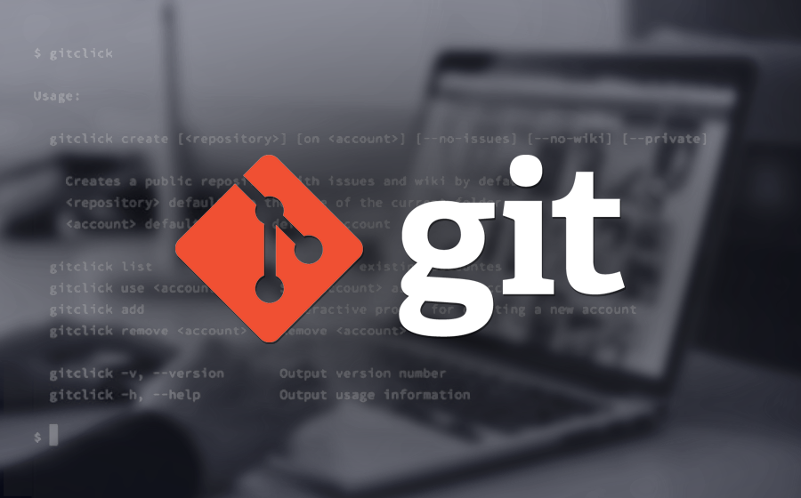
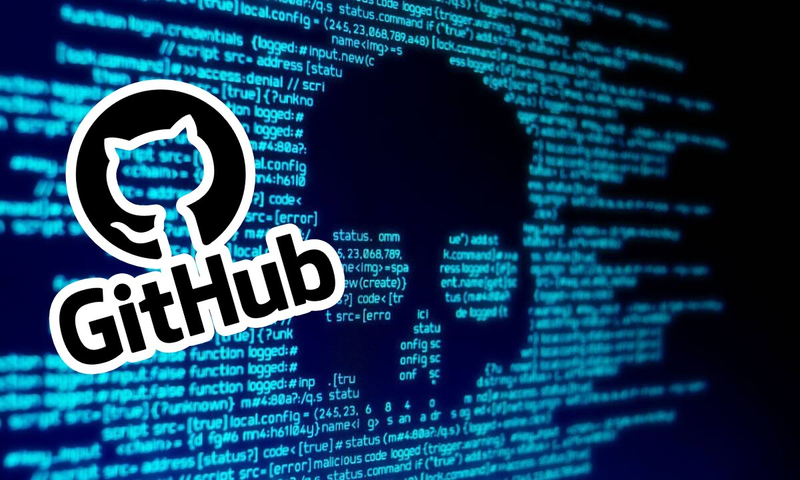

# Qué es Git?

  

Git es un sistema de control de versiones de código que permite a los desarrolladores rastrear los cambios en el código fuente a lo largo del tiempo, colaborar en un proyecto y mantener un historial completo de todas las modificaciones realizadas. Es una herramienta esencial para cualquier equipo de desarrollo de software ya que permite trabajar de manera eficiente, organizada y segura en proyectos de cualquier tamaño. Con Git, los desarrolladores pueden trabajar de manera descentralizada y no necesitan una conexión a internet para funcionar. Es una de las herramientas más populares y ampliamente utilizadas en la industria.

# ¿Qué es GitHub?

  

GitHub es una plataforma web que proporciona alojamiento para proyectos de control de versiones que utilizan Git. Es una herramienta popular para desarrolladores de todo el mundo para alojar, compartir y colaborar en proyectos de código abierto y privado. Con GitHub, los desarrolladores pueden crear repositorios para alojar su código, seguir el progreso del proyecto, colaborar con otros desarrolladores y hacer contribuciones a proyectos de código abierto existentes. Además, GitHub proporciona una variedad de funciones adicionales, como la posibilidad de realizar revisiones de código, crear problemas y solucionarlos, y utilizar integraciones de terceros para mejorar el flujo de trabajo del equipo.

# Instalación de Git en Windows
1. Descarga el instalador de Git para Windows desde el sitio web oficial de Git: https://git-scm.com/download/win
2. Ejecuta el archivo descargado e instala Git siguiendo las instrucciones del asistente de instalación.
3. Abre una ventana de comandos (cmd) y verifica la instalación ejecutando el comando `git --version`. Debería mostrarte la versión de Git que acabas de instalar.

# Instalación de Git en Linux
1. Abre una terminal y ejecuta el comando `sudo apt-get install git` (para distribuciones basadas en Debian) o `sudo yum install git` (para distribuciones basadas en Red Hat).
2. Verifica la instalación ejecutando el comando `git --version`. Debería mostrarte la versión de Git que acabas de instalar.

# Configuración básica de Git
1. Configura tu nombre de usuario y correo electrónico en Git. Este paso es importante para identificar quién está realizando los cambios en el repositorio. Ejecuta los siguientes comandos en tu terminal o línea de comandos:

    `git config --global user.name "Tu nombre de usuario"`
    `git config --global user.email "tu-correo@ejemplo.com"`

2. Configura el editor de texto predeterminado que deseas utilizar con Git. Por ejemplo, si deseas utilizar el editor de texto "nano", ejecuta el siguiente comando:

    `git config --global core.editor nano`

3. (Opcional) Configura una clave ssh para conectarte a repositorios remotos de forma segura. Este paso es necesario si deseas trabajar con repositorios remotos y deseas evitar ingresar tu contraseña cada vez que realices una operación. Puedes generar una clave ssh siguiendo las instrucciones en este enlace https://docs.github.com/es/github/authenticating-to-github/generating-a-new-ssh-key-and-adding-it-to-the-ssh-agent

4. (Opcional) Configura un alias para comandos de git. Los alias son una forma de asignar un nombre corto a un comando de git para facilitar su uso. Por ejemplo, si deseas crear un alias para el comando `git log --oneline --decorate --graph --all` puedes usar el siguiente comando: 

    `git config --global alias.lg "log --oneline --decorate --graph --all"`

# Creación de tu primer repositorio en Git
1. Crea una carpeta en tu sistema para alojar tu repositorio. Puedes llamarlo como desees, pero asegúrate de elegir un nombre significativo.

2. Abre una terminal o línea de comandos y navega hasta la carpeta que acabas de crear.

3. Inicia el repositorio utilizando el comando `git init`. Este comando creará una carpeta oculta llamada `.git` en la carpeta actual que alojará toda la información del repositorio.

4. Crea algunos archivos y carpetas en la carpeta del repositorio. Puedes crear cualquier tipo de archivo o carpeta que desees, pero es recomendable crear al menos un archivo de texto vacío llamado "README" que describa el proyecto.

5. Agrega los archivos creados al repositorio utilizando el comando `git add .`. El punto al final del comando indica que se deben agregar todos los archivos en la carpeta actual. Si solo deseas agregar un archivo específico, puedes especificar su nombre en lugar del punto.

6. Realiza una "commit" de los cambios utilizando el comando `git commit -m "Mensaje de commit inicial"`. El mensaje de commit es importante ya que describe los cambios realizados en el repositorio. Asegúrate de elegir un mensaje significativo.

7. (Opcional) Si deseas subir tu repositorio a un servidor remoto como GitHub, debes crear un repositorio en GitHub y seguir las instrucciones para conectarte a él desde tu computadora utilizando el comando `git remote add origin <url del repositorio>`. Luego podrás subir tus cambios con el comando `git push -u origin master`

# Estados de Git
Git tiene tres estados principales:

1. **Working Directory**: Es la carpeta donde tienes los archivos de tu proyecto en tu computadora. Es el estado original de los archivos antes de ser agregados al repositorio.

2. **Staging Area**: Es el estado intermedio en el que los archivos son preparados para ser "commit"eados. Los archivos en el área de preparación están listos para ser incluidos en el próximo commit. Puedes usar el comando `git add` para mover los archivos desde el directorio de trabajo al área de preparación.

3. **Repository**: Es el estado final en el que los archivos son guardados en el repositorio de Git. Una vez que se realiza un "commit", los archivos en el área de preparación se mueven al repositorio y se guardan en la historia de versiones de Git. Puedes usar el comando `git commit` para mover los archivos desde el área de preparación al repositorio.

Es importante tener en cuenta que un archivo puede pasar a través de estos estados varias veces a medida que se realizan cambios y se registran versiones del proyecto.
